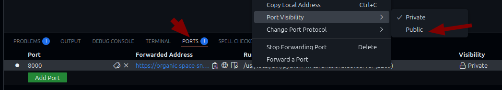

# Development Server

The Functions SDK includes a development server that allows you to run your Functions in your development environment. The server reads Functions from the `environment.yaml` file and makes them available via HTTP endpoints. You can then connect these Functions to your CIM Database Cloud instance using webhooks.

This speeds up the development of Functions because you can instantly test your changes without deploying them to the cloud infrastructure first.

## Starting the Server

You can start the development server using the following command:

```bash
python -m csfunctions.devserver
```

You can set the port of the server using the `--port` flag (default is 8000), or by setting the `CON_DEV_PORT` environment variable:

```bash
python -m csfunctions.devserver --port 8080
```

You can set the directory containing the `environment.yaml` file using the `--dir` flag (by default, the current working directory is used) or by setting the `CON_DEV_DIR` environment variable:

```bash
python -m csfunctions.devserver --dir ./my_functions
```

You can enable HMAC verification of requests using the `--secret` flag, or by setting the `CON_DEV_SECRET` environment variable:

```bash
python -m csfunctions.devserver --secret my_secret
```

## Autoreloading

The development server will automatically restart if you make changes to your Functions code or to the `environment.yaml` file.

## Exposing the Server

To enable your CIM Database Cloud instance to send webhook requests to your Functions, you need to make the server accessible from the internet. Here are several ways to do this:

**GitHub Codespaces**

If you are developing Functions in a GitHub Codespace, you can expose the server by right-clicking on the dev server's port in the "Ports" tab and changing the visibility to "Public":



You can then copy the URL of the server and use it to connect your Functions to your CIM Database Cloud instance using webhooks.

**ngrok and Cloudflare**

If you are developing Functions locally, you can use services like [ngrok](https://ngrok.com/){:target="_blank"} or [Cloudflare](https://cloudflare.com){:target="_blank"} to expose your server to the internet.

Please refer to the documentation of the specific service for instructions on how to do this.

## Create a Webhook in CIM Database Cloud

To test your Functions locally, create a webhook in your CIM Database Cloud instance and point it to your development server.

The webhook URL should combine your development server URL with the Function name from your `environment.yaml` file using this format:

`https://<development-server-url>/<function-name>`

For example, the `example` function would be available at:

```
https://mycodespace-5g7grjgvrv9h4jrx-8000.app.github.dev/example
```

Make sure to set the webhook's event to the correct event you want to test with your Function.

For more detailed information on how to create a webhook in CIM Database Cloud, please refer to the [CIM Database Cloud documentation](https://saas-docs.contact-cloud.com/2025.7.0-en/admin/admin-contact_cloud/saas_admin/webhooks).

## Securing the Development Server

Since the development server is exposed to the outside world, you should secure it to prevent unauthorized access.

You can enable HMAC verification of requests using the `--secret` flag, or by setting the `CON_DEV_SECRET` environment variable:

```bash
python -m csfunctions.devserver --secret my_secret
```

Make sure to use the same secret in your CIM Database Cloud instance when setting up the webhook and enable HMAC signing.
