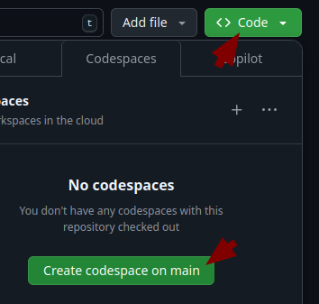

This guide will help you get started building your first Function and deploying it to CIM Database Cloud.

## Setting up your Codespace

The first step to developing your own Functions is setting up a development environment. To make this simple, we recommend using GitHub Codespaces, which is a remote development environment that you can access through your browser. No local setup required!

!!! note

    If you are an experienced developer and wish to set up a development environment on your own machine, you can skip Codespaces and install the SDK in a local Python environment using `pip install contactsoftware-functions`.

To get started, head to the template repository for Functions: [https://github.com/cslab/functions-template-python](https://github.com/cslab/functions-template-python){:target="_blank"}

- You need a (free) account on GitHub.
- Copy the repository by clicking the "Use this template" button on the top right and select "Create a new repository".

    

- Make sure your new repository is set to private!

    

- In your new repository, create a development container by clicking on the green "Code" button and selecting "Create codespace on main".

    

    This will take a few minutes, and you will see a new tab open in your browser with a development container running.

After completing these steps, you will have a development environment with all required tools already installed!

## Build your first Function

### File structure

A minimal Function implementation consists of three files:

- `environment.yaml` describes the environment and the Functions contained in it
- `requirements.txt` contains the dependencies of your Functions (usually only contactsoftware-functions)
- `mymodule.py` is a Python file containing the code of your Functions (feel free to pick a different name)

Here is the complete structure:

``` bash
  src/
  ├── environment.yaml
  ├── mymodule.py
  └── requirements.txt
```

If you are using the Codespaces template repository, you will find that it already contains the required file structure—including a small example Function.

### Function Code
Start by writing the code for your first Function. As a first example, you will write a Function that prevents you from creating documents with the title "Test".
If you are interested in more complex (and realistic) examples, check out the [Examples](examples/index.md) section of this documentation.

In this example, you will use the [DocumentCreateCheckEvent](reference/events.md/#documentcreatecheckevent). It contains a list of documents that are about to be created. Typically, this will only be a single document; however, it is best practice to iterate over all of the documents.

``` python title="mymodule.py"
from csfunctions import MetaData, Service
from csfunctions.events import DocumentCreateCheckEvent
from csfunctions.actions import AbortAndShowErrorAction

def prevent_test_document(metadata: MetaData, event: DocumentCreateCheckEvent, service: Service):
  # iterate over the documents contained in the event
  for document in event.data.documents:
    # for each document, check if the title starts with "Test"
    if document.titel.startswith("Test"):
      # abort and show an error message to the user
      return AbortAndShowErrorAction(message="Test documents are not allowed.")

  # if no documents match the condition the Function doesn't need to do anything
  return
```

!!! tip
    Using type annotations is not required in Python, but it is highly recommended, as it allows your code editor to give you better autocomplete recommendations and helps you spot mistakes faster.

### Register the Function

The Function needs to be registered in the `environment.yaml` config file. If you are using the Codespaces template, the config file already contains a reference to the example Function. You can just add another entry for your new Function below:


``` yaml title="environment.yaml"
runtime: python3.10
version: v1
functions:
  # this is the example Function from the template
  - name: example
    entrypoint: example_module.example_doc_release_check
  # just add your new Function below like this:
  - name: prevent_test_document
    entrypoint: mymodule.prevent_test_document
```

You can add as many functions to the list as you like. The function `name` can be chosen freely and doesn't have to match the name of your Python method (although it is recommended that it does). The name will be used to identify the Function in your CIM Database Cloud instance. The `entrypoint` needs to be the import path of your Python function.

### Dependencies
Lastly, define your code's dependencies in the `requirements.txt`:

``` python title="requirements.txt"
contactsoftware-functions
```
`contactsoftware-functions` will always need to be in the requirements.txt unless you register your own main_entrypoint (see [Python runtime](reference/runtime.md)).

The Codespaces template already includes the required dependencies.


## Test your code

To test if your Function works as intended, you could now proceed to upload the code to CIM Database Cloud (as described in the next section). However, to speed up development, it is recommended to use the development server that is built into **csfunctions** to run and test the code in your local development environment.

Head over to the [development server documentation](development_server.md) to find out how to run your Functions locally. Once you are happy with your Function's code, proceed to the next section of this guide to learn how to deploy your code to the CIM Database Cloud serverless infrastructure.

## Deploy the code

To deploy your code to CIM Database Cloud, you first need to retrieve your Functions developer credentials. This requires you to have the **Functions Developer** role in the CONTACT Portal. The role can be assigned to you by your organization's administrator in the CONTACT Portal.

- Go to the CONTACT Portal [https://portal.contact-cloud.com](https://portal.contact-cloud.com){:target="_blank"} and log in.
- Open the menu in the top right corner and click on your name.
    
- In the context menu of your user, click on "Display credentials for functions development".
    


You can then use the [Functions client](https://pypi.org/project/contactsoftware-functions-client/){:target="_blank"} to upload your Function code to CIM Database Cloud. If you are using Codespaces, the Functions client is already installed. Otherwise, you can install it with `pipx install contactsoftware-functions-client`.


Log in with the credentials you retrieved from the CONTACT Portal:

```bash
cfc login
```

Create a new [Function Environment](key_concepts.md#function-environments):

```bash
cfc env create myenv
```

Upload code into the new environment:

```bash
cfc env deploy myenv
```

!!! warning
    Uploading code into an environment will overwrite the existing code in the environment.

## Connect the Function

The final step is to connect your Function to an event in your CIM Database Cloud instance. You need to have the **Administrator** role in the instance to do this.

To connect your Function, open the Application Setup in your CIM Database Cloud instance and create a new Function:


In the dialog, select the event that should trigger your Function. For this example, choose *document_create_check*.

Find your environment's name in the *Environment* drop-down menu, then select your Function. The Function's name will match the name you used when you [registered the Function](#register-the-function) in the `environment.yaml` file.

!!! tip

    If you can't find your environment or Function in the drop-down menu, make sure the Function was deployed successfully to CIM Database Cloud. Try closing and reopening the dialog to refresh the list of environments.


!!! note

    CIM Database Cloud instances can only see Functions uploaded by users from the organization the environment belongs to. If you were invited to a CIM Database Cloud instance from a different organization, you will not be able to connect your Functions to that instance.
