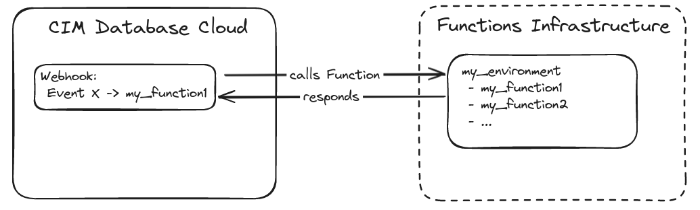

## Webhooks
Webhooks in __CIM Database Cloud__ can be used to call HTTP endpoints with context-related metadata for certain events (e.g. document release).
Further information about webhooks can be found in the [CIM Database Cloud documentation](https://saas-docs.contact-cloud.com/2025.14.0-en/admin/admin-contact_cloud/saas_admin/webhooks){:target="_blank"}.

## Functions

Events in CIM Database Cloud can also trigger **Functions**, which represent user defined code that is executed in the CIM Database Cloud serverless infrastructure. This allows customers to extend the functionality of CIM Database Cloud with custom business logic.

<figure markdown="span">
  
  <figcaption></figcaption>
</figure>

## Function Environments

Functions are grouped into **Function Environments**, which are the container the code runs in. An environment contains a runtime for its specific programming language, the Function code and a configuration file describing the environment.

If the Functions in an environment have not been executed in a while, the environment will become "cold" and the next start of a Function will take a bit longer. Therefore it is recommended to place all your Functions in the same environment.

Function environments are created with the [Functions client](https://pypi.org/project/contactsoftware-functions-client/){:target="_blank"}:

```bash
pipx install contactsoftware-functions-client

cfc login
cfc env create myenvironment
```
